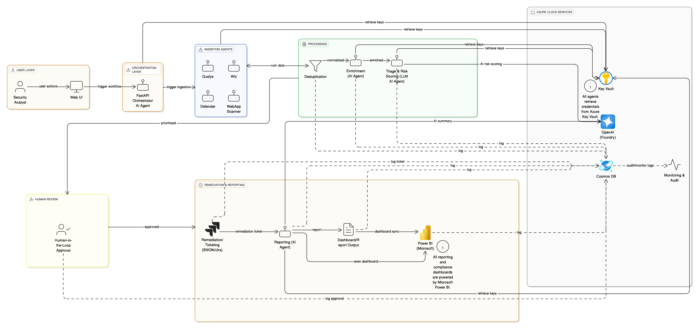

# Vulnerability Management Orchestration Template

## Solution Overview
The Vulnerability Management Orchestration Template is a modular, AI-powered automation solution for managing, triaging, and remediating vulnerabilities across cloud and enterprise environments. This repository provides reference architecture, deployment scripts, and code scaffolding that can be adapted for client-specific implementations.



See full architecture and data flows in [MRA_Vulnerability_Management.md](01_Architecture/MRA_Vulnerability_Management.md).

**Key Capabilities**
- Multi-source ingestion (Nexpose, Wiz, Defender, WebApp Scanners)
- Modular AI agent orchestration (Microsoft Foundry + Azure OpenAI)
- Human-in-the-loop risk validation and approval
- Automated ITSM integration for remediation (ServiceNow, Jira)
- Real-time dashboards and compliance reporting (Power BI)
- Full Azure-native security, secrets, and logging

The web-based UI included here is repurposed from a Microsoft solution
accelerator and now acts as the front-end orchestrator for this template.

For this deployment, the **Qualys Ingestion Agent** functions as the
Nexpose/InsightVM ingestion agent. Connection details and credentials are
fetched from Azure Key Vault using the secrets `nexpose-api-url`,
`nexpose-user`, and `nexpose-password`. **All credentials are managed only via
Key Vault.**

### Workflow Stages and Agent Roles

1. **Ingestion** – gather findings using `IngestionAgent`.
2. **Deduplication** – remove duplicates with `DeduplicationAgent`.
3. **Enrichment** – add asset and threat context via `EnrichmentAgent`.
4. **Triage** – assign risk scores using `TriageAgent`.
5. **Approval** – analysts review results through `ApprovalAgent`.
6. **Remediation** – create ITSM tickets with `RemediationAgent`.
7. **Reporting** – generate dashboards via `ReportingAgent`.

## Quick Start
1. **Clone or fork the template repository**
2. **Install required tools:**
   - [Azure Developer CLI (`azd`)](https://learn.microsoft.com/en-us/azure/developer/azure-developer-cli/install-azd)
   - [Python 3.11+](https://www.python.org/downloads/)
   - [Node.js 18](https://nodejs.org/)
3. **Install Python dependencies:**
   ```bash
   pip install -r requirements.txt
   ```
The frontend Dockerfile uses `uv` with `uv.lock` for deterministic builds. You
can optionally install using `uv` locally:
```bash
uv pip install -r src/frontend/uv.lock
```
Dockerfiles are provided for each backend agent under `src/agents/*` and in
`src/orchestrator` to build container images consistently.
4. **Install frontend dependencies and run tests:**
   ```bash
   cd src/frontend
   npm ci
   npm test
   cd ../..
   ```
   The Jest-based tests automatically launch `frontend_server.py` to serve the UI during the run.
5. **Copy `.env.sample` to `.env`** and fill in environment-specific secrets and endpoints.
6. **Review and update `/05_Infrastructure/` Bicep templates** as needed. The
  container app module exposes parameters for `orchestratorImage`,
  `ingestion_agentsImage`, `minReplicas`, `maxReplicas`, `cpu`, and `memory` which can
  be customized. A `useSampleImages` flag lets you deploy sample
  `containerapps-helloworld` containers when you haven't built your own images.
  Replace the defaults with images pushed to your Azure Container Registry or
  supply parameters at deploy time using the `--infra-parameter` option.
7. **Add your resource group configuration**
   After creating a new repo from this template, add an `infra:` section to
   `azure.yaml` specifying your Azure Resource Group before running `azd up`:

   ```yaml
   infra:
     provider: bicep
     path: 05_Infrastructure
     resourceGroup: MyResourceGroupName
   ```
8. **Run `azd up`** (or `./06_DevOps/deployment_scripts/azd_up.sh`) to
   provision Azure resources and deploy code.
9. **Access the User Portal** and test ingestion, triage, and remediation workflows.
10. **Review logs and dashboards** in Application Insights, Log Analytics, and Power BI.

> **Note**: The template does not set a default resource group. You must set this per deployment to avoid accidental collisions between projects and environments.

## Running the Orchestrator API

You can start the orchestration service locally using Uvicorn:

```bash
uvicorn src/orchestrator/main:app --reload
```

The service listens on port **8000** by default and binds to `127.0.0.1`.
Set the `ORCHESTRATOR_HOST` environment variable to change the bind address
(for example `0.0.0.0` to allow remote access). Use `ORCHESTRATOR_PORT` to
expose the service on a different port.

**Available API endpoints**
- `/api/triage` – triage a finding using `TriageAgent`.
- `/api/remediate` – create a remediation ticket with `RemediationAgent`.
- `/api/report` – generate a simple report via `ReportingAgent`.

## Running Tests
After installing the dependencies you can run the unit tests to verify the stub implementations:

```bash
pytest
```

### Testing Nexpose Connectivity
The ingestion agent provides a helper script to verify that the Nexpose API is
reachable and that your Key Vault secrets are configured correctly.

Set the `KEY_VAULT_NAME` environment variable to the vault containing the
`nexpose-api-url`, `nexpose-user`, and `nexpose-password` secrets and run:

```bash
python scripts/nexpose_check.py
```

If the script succeeds it prints the number of assets returned and a snippet of
the response.

### Running Frontend Tests
To execute the UI test suite locally:

```bash
cd src/frontend
npm ci
npm test
```
The tests spin up the Python-based server automatically.

These tests also run automatically in the CI pipeline.

## Environment Variables
The portal uses several environment variables for configuration. Default values are applied when running locally, but you can override them in a `.env` file:

- `BACKEND_API_URL` – Base URL for the orchestrator API. Defaults to `http://localhost:8000`.
- `AUTH_ENABLED` – Set to `True` or `False` to toggle EasyAuth. Defaults to `True`.
- `POWERBI_EMBED_URL` – Optional link to embed a Power BI dashboard in the compliance page.

Copy `.env.sample` to `.env` and set these variables to suit your environment.

### Configuring `azd`
The deployment workflow uses [Azure Developer CLI](https://learn.microsoft.com/azure/developer/azure-developer-cli/overview). Export the following variables before running `azd up` or set them in your CI secrets:

- `AZURE_SUBSCRIPTION_ID` – target subscription ID
- `AZURE_TENANT_ID` – tenant for the service principal
- `AZURE_CLIENT_ID` and `AZURE_CLIENT_SECRET` – credentials for a service principal with contributor rights

The infrastructure templates will automatically provision an Azure Container Registry and expose its endpoint to your environment.

Run `azd auth login --client-id $AZURE_CLIENT_ID --client-secret $AZURE_CLIENT_SECRET --tenant-id $AZURE_TENANT_ID` in your automation before executing `azd up`.

## Infrastructure Parameters
The Bicep templates under `/05_Infrastructure/` expose additional parameters for
the container apps:

 - `orchestratorImage` and `ingestion_agentsImage` – container images to deploy.
 - `minReplicas` and `maxReplicas` – scale settings for each app.
 - `cpu` and `memory` – resource allocation per replica (e.g. `0.5` CPU and
   `1Gi` of memory).

Defaults are defined in [`main.bicep`](05_Infrastructure/main.bicep). These
include image paths using your Azure Container Registry name followed by the
service (for example `${containerRegistryName}.azurecr.io/orchestrator:latest`).
Override these values when running `azd up` with `--infra-parameter` or by
editing the file directly. The helper script
`./06_DevOps/deployment_scripts/azd_up.sh` shows one way to pass the parameters.

### Service Tagging Requirement
Every service declared in `azure.yaml` must have a matching resource in the
Bicep infrastructure templates. Each of these resources needs the tag:

```bicep
tags: {
  'azd-service-name': '<service_name>'
}
```

The repository is considered **service-tag-complete** when all services are
represented and tagged. Deployments with `azd up` rely on this mapping to
provision and deploy each service correctly.

## Launching the API with Uvicorn
FastAPI is included in `requirements.txt`, so you can start the API locally with:

```bash
uvicorn src/orchestrator/main:app --reload
```

## How to Adapt for Clients
To tailor the template for a specific environment:
1. **Change scanner endpoints and credentials** in the `.env` file and relevant configuration scripts.
2. **Update Azure region and scaling parameters** by editing the Bicep templates under `/05_Infrastructure/`.
3. **Customize reporting (Power BI) fields and dashboards** in the `src/templates/PowerBI/` folder.
4. **Brand the User Portal UI** by modifying styles and assets in `/src/portal/`.
5. **Set the `POWERBI_EMBED_URL` environment variable** with your Power BI dashboard link to embed it in the compliance page.

## Reference
See [`01_Architecture/MRA_Vulnerability_Management.md`](01_Architecture/MRA_Vulnerability_Management.md) for the full architecture specification.

## License
This project is licensed under the [MIT License](LICENSE).
